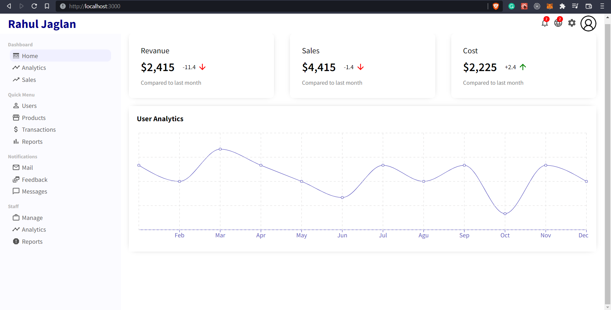
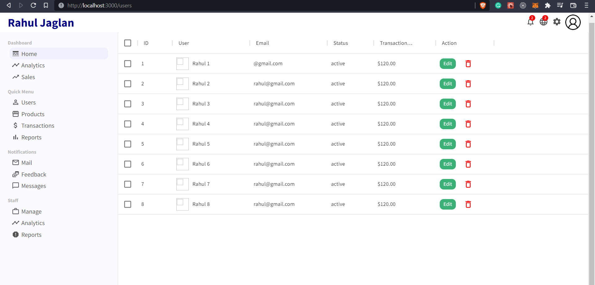

# Getting Started with Create React App

To run the application

### `npm start`

Runs the app in the development mode.\
Open (http://localhost:3000) to view it in the browser.

The page will reload if you make edits.\
You will also see any lint errors in the console.

To run the production version of the app

### `npm run build`

